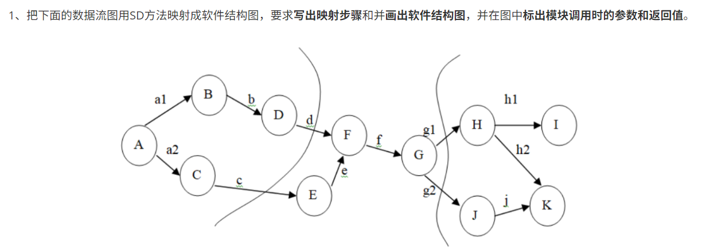
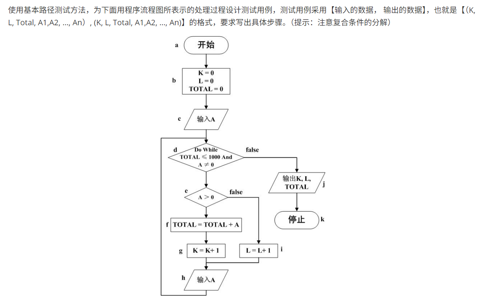
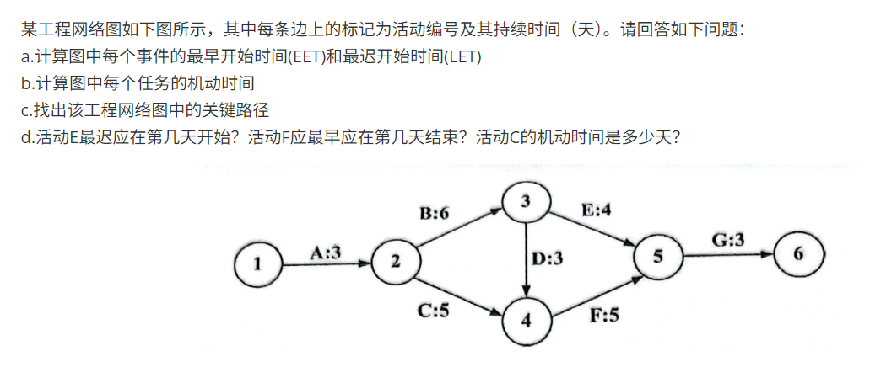
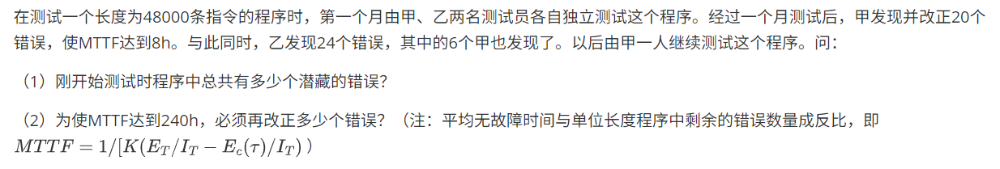

## 软件工程A
### 本篇经验贴作者：陈赓
### 本门课成绩：92.8分

### **22级期末考题型回顾**：
- 选择题（20分，20道题目每题1分）
- 判断题（10分，10道题目每题1分）
- 名词解释（10分，5道题目每题2分）
- 简答题（30分，6道题目每题5分）
- 分析设计题（30分，2道题目每题15分）

### **22级真题回顾**
本部分参考了大佬的回忆：
- https://blog.csdn.net/weixin_73514025/article/details/144067789
- https://blog.csdn.net/2301_79721861/article/details/144167399

感谢大佬们

#### 选择题
- 本部分20分，共20题，每题1分
- 全都是冯铁老师平时作业的原题

#### 判断题
- 本部分10分，共10题，每题1分
- 全都是冯铁老师平时作业的原题

#### 名词解释
- 本部分10分，5道题目，每道题目有2个或1个英文单词，用中文进行解释【考试时只给了英文，而且同一道题中的英文有很大关联性】
1. **validation & verification**
   - validation：确认。确认是确保软件满足用户实际需求和期望的过程。它关注的是外部的有效性，即产品是否解决了它应该解决的问题。
   - verification：验证。验证是确保软件符合其设计和规格的过程。它关注的是内部的正确性，检查我们是否遵循了既定的规则、标准和设计文档。
2. **configuration management & baseline**
   - configuration management：配置管理。这是一个过程和体系，用于在软件的整个生命周期中系统地标识、组织、控制和跟踪软件配置项（如代码、文档、测试用例等）的变更。
   - baseline：基线。基线是在配置管理过程中，一个或多个配置项在某个特定时间点已经通过正式评审和同意的“稳定快照”。它是一个固定的参考点。
3. **coupling & cohesion**
   - coupling：耦合。衡量模块与模块之间的依赖程度。耦合度越高，模块间的关联性越强。
   - cohesion：内聚。衡量一个模块内部各个元素（如函数、数据）之间关联的紧密程度。内聚度越高，说明模块的功能越专一。
4. **deliverable & artifact**
   - deliverable：可交付成果。特指那些需要正式交付给客户或利益相关者的工件。它通常是项目合同或计划中明确规定的产出。
   - artifact：工件。在软件开发过程中产生的任何产出物。
5. **regression test**
    - regression test：回归测试。回归测试是一种软件测试类型，旨在验证最近的程序或代码变更（如新功能开发、Bug修复、配置更改）是否没有对现有功能产生意外的负面影响。

#### 简答题
- 本部分共6题，每题5分
1. **数据流图用SD方法映射成软件结构图**
    - 类似于下面（并非原题）

  

2. **层次结构的优点，举例说明**

3. **基本路径测试**
    - 类似于下面（并非原题）

  

4. **工程网络图**
    - 类似于下面（并非原题）

  

5. **MTTF计算题**
    - 类似于下面（并非原题）

  

6. **需求分析应该从那些方面考虑？指出下列需求存在什么问题**
    - 发现任何不友好并且带有未知任务的或者有可能在五分钟之内飞入空中禁区的飞行物时要拉响警报。
    - 关于选择计划的全部约束是：如果没有选择最优计划也不提供证据，客户应该选择默认的基本计划。
    - 系统能够对用户的身份进行快速验证。
    - “列车车门在两个停靠站之间要保持关闭”；“列车发生紧急停车时，要打开车门”。

【第6题是冯铁老师PPT上一模一样的内容，我在复习的时候也整理在“软件工程期末复习.pdf”里面了】

#### 计算题
- 本部分共2道题，第一题是根据文字描述自己画数据流图（而不是填空），第2题是根据纯英文的描述画用例图和类图。

1. **数据流图**
    - 根据下列描述，画出数据流图：
    - 某慕课教育平台欲添加在线作业批改系统，以实现高效的作业提交与批改，并进行统计。学生和讲师的基本信息已经初始化为数据库中的学生表和讲师表。系统的主要功能如下：
        - 提交作业。验证学生标识后，学生将电子作业通过在线的方式提交，并进行存储。系统给学生发送通知表明提交成功，通知中包含唯一编号；并通知讲师有作业提交。
        - 下载未批改作业。验证讲师标识后，讲师从系统中下载学生提交的作业。下载的作业将显示在屏幕上。
        - 批改作业。讲师按格式为每个题目进行批改打分，并进行整体评价。
        - 上传批改后的作业。将批改后的作业（包括分数和评价）返回给系统，进行存储。
        - 记录分数和评价。将批改后的作业的分数和评价记录在学生信息中，并通知学生作业已批改
        - 获取已批改作业。根据学生标识，给学生查看批改后的作业，包括提交的作业、分数和评价。
        - 作业抽检。根据教务人员标识抽取批改后的作业样本，给出抽检意见，然后形成抽检报告给讲师。

2. **画用例图和类图**
    - 这一题在考试的时候看到的时候说实话被恶心到了，也可以说是唯一没预料到的题目。
    - 纯英文的题面，大致内容应该是：有一个诊所，涉及到医生、护士、前台、病人这么几个角色，然后每个角色都有对应的动作，比如病人需要定期来检查等等。

### **备考策略**：
- 这门课考试的时候除了最后一题，前面做的飞快，因为基本都准备到了。但选择、判断和名词解释考的还是
- 如果你看到前面的真题回顾，会发现“冯铁老师”的出现频率极高，因为22级的期末考试题就是冯铁老师出的，而且冯铁老师在讲课的时候会带有出题倾向，所以我当时复习的时候的策略是这样的（如果是冯铁老师出题，可以参考一下这个复习策略）：
    - 把冯铁老师的学在吉大每一节课都认真看了一遍，然后把冯老师上课时候提到的“重点”和“这个需要记一下/关注一下”的部分整理进了“笔记”文件夹中的“软件工程期末复习.pdf”。
    - 同时根据“冯铁老师的PPT”，整理了“笔记”文件夹中的“软件工程笔记.pdf”。同时整理PPT中所有英文中可能出名词解释的题目。
    - 做了好几遍“软件工程作业”文件夹中冯铁老师发布的章节测试的题目。（最后发现选择和判断全是从这里面出的）
    - 根据冯铁老师说的大题会考的题型，整理奔腾中出现过的类似的题目（部分进了“笔记”文件夹中的“软件工程期末复习.pdf”）
 - 我上传的资料可以说覆盖了80%期末考的题目，除了最后一题英文题没有预判到，别的基本上预判到了，甚至很多是原题。如果学的时候PPT看不懂，可以看我上传的教材，里面讲解的比较详细，每章后面也有对应的习题可以练习。

### 网上可以参考的其他资料
- https://yorelee.blog.csdn.net/article/details/139220045
- https://blog.csdn.net/m0_74740382/article/details/143276648
